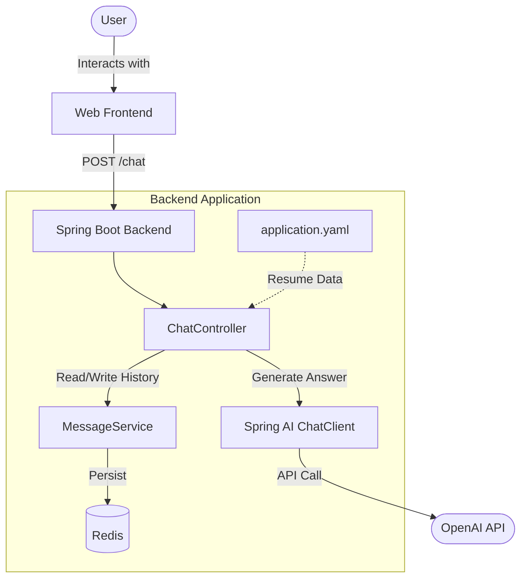

# Resume Bot

Resume Bot is a Spring Boot application that leverages Artificial Intelligence to answer questions regarding a resume. It acts as a virtual assistant representing the candidate, capable of conversing using information extracted from the configured resume.

## Features

*   **AI Resume Analysis**: Uses OpenAI models (via Spring AI) to understand and answer questions about professional background.
*   **Contextual Conversation**: Maintains conversation history for more natural exchanges.
*   **Personalized Perspective**: The AI responds in the first person ("I"), embodying the candidate.
*   **Observability**: Integrates Spring Boot Actuator and Micrometer (OTLP) for monitoring.
*   **Containerization**: Docker and Kubernetes ready with Cloud Native Buildpacks support.

## Architecture



## Prerequisites

*   **Java 25** (or compatible version configured in `pom.xml`)
*   **Docker** (required to run Redis via Docker Compose)
*   An **OpenAI** API key

## Configuration

### OpenAI API Key

You must set the `SPRING_AI_OPENAI_API_KEY` environment variable with your OpenAI API key before starting the application.

### Customizing the Resume

The resume content is configured directly in the `src/main/resources/application.yaml` file under the `app.resume` property. You can paste the raw text of your resume there.

```yaml
app:
  resume: |
    Alexandre Roman
    Senior Software Engineer
    ...
```

## Getting Started

To run the application in development mode (uses Docker Compose to start Redis automatically):

```bash
./mvnw spring-boot:run
```

The application will be accessible at `http://localhost:8080`.

## Usage

The application exposes a REST API to interact with the bot.

### Endpoint

`POST /chat`

### Request Example

```bash
curl -X POST http://localhost:8080/chat \
  -d "prompt=What is your experience with Java?" \
  -d "conversationId=12345"
```

### Parameters

*   `prompt` (Required): The question to ask the bot.
*   `conversationId` (Optional): A unique identifier to maintain conversation context.

### Response

The response is a plain text string (Markdown formatted) containing the answer.

## Technologies

*   [Spring Boot 3.5](https://spring.io/projects/spring-boot)
*   [Spring AI](https://spring.io/projects/spring-ai)
*   [Redis](https://redis.io/) (for storing conversation history)
*   [Testcontainers](https://testcontainers.com/) (for integration tests)

## License

This project is licensed under the Apache 2.0 License. See the `LICENSE` file for more details.
